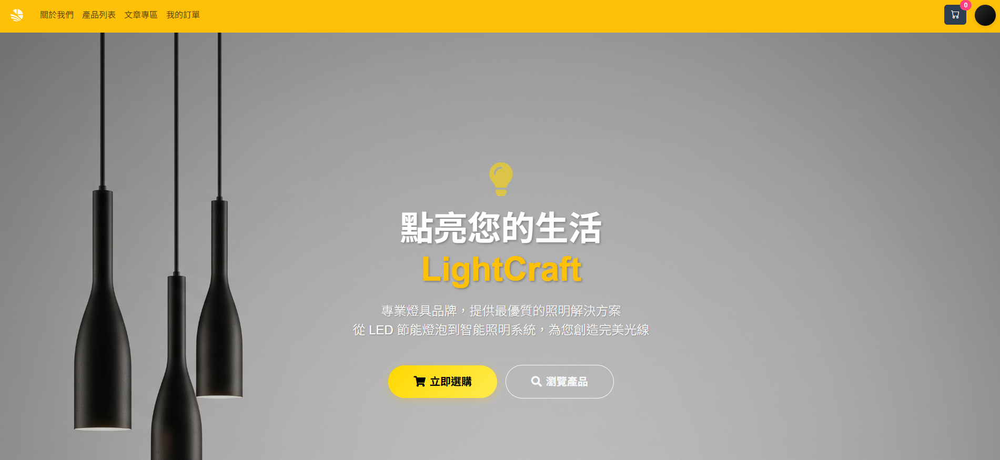
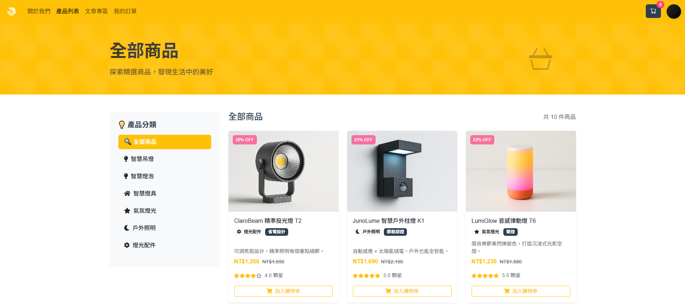
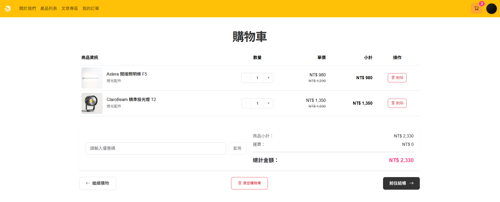
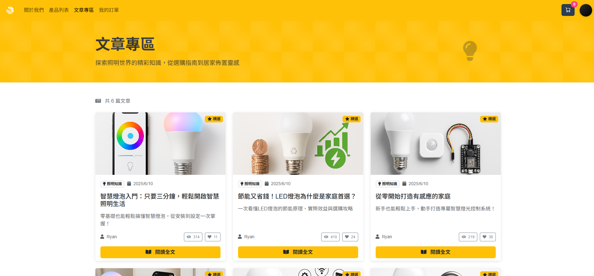
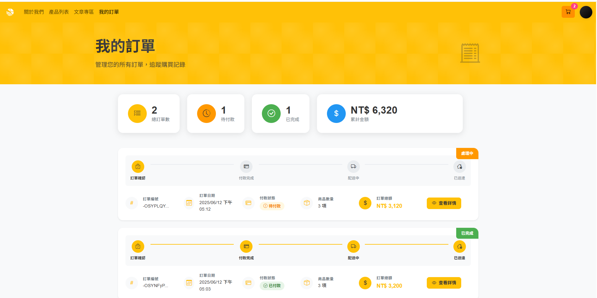
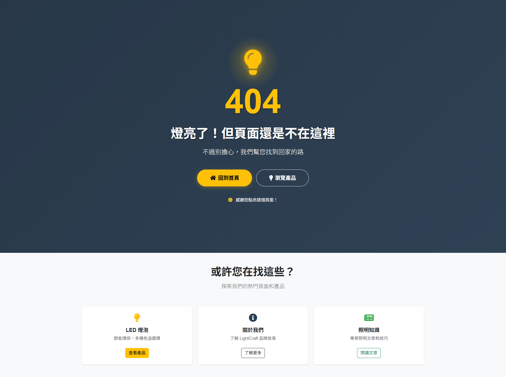
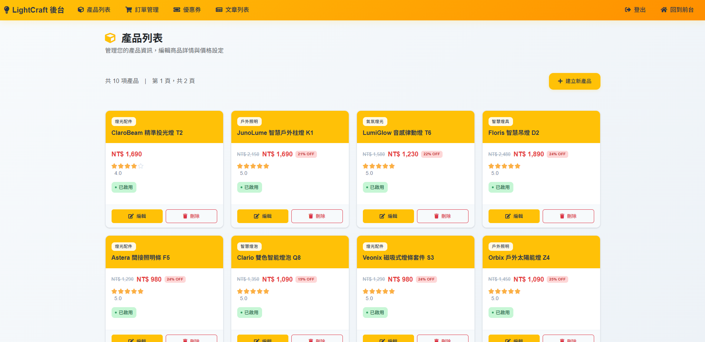
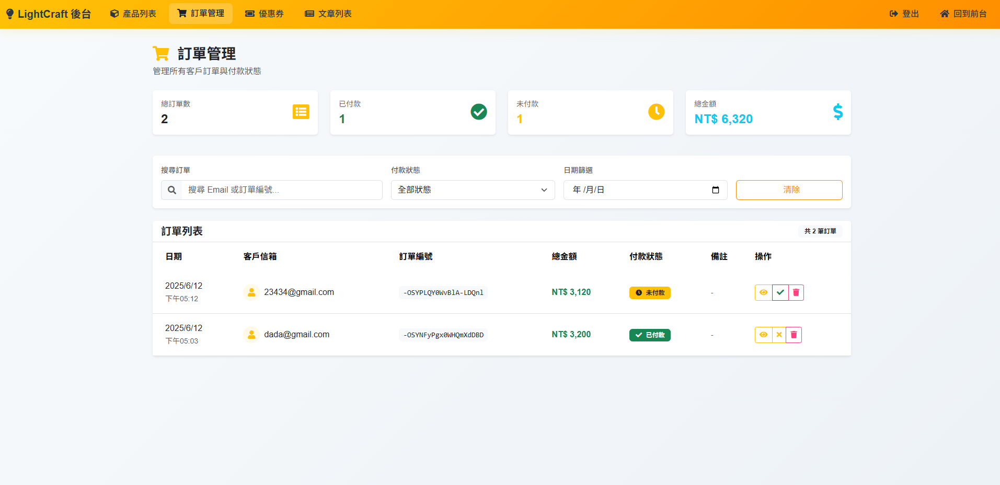
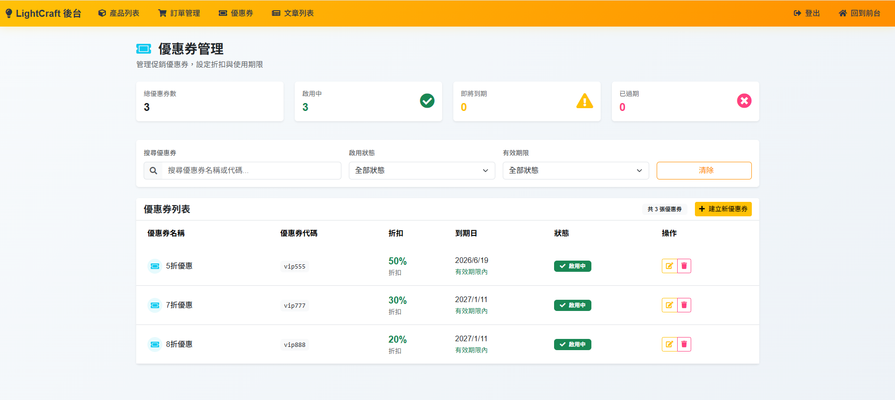
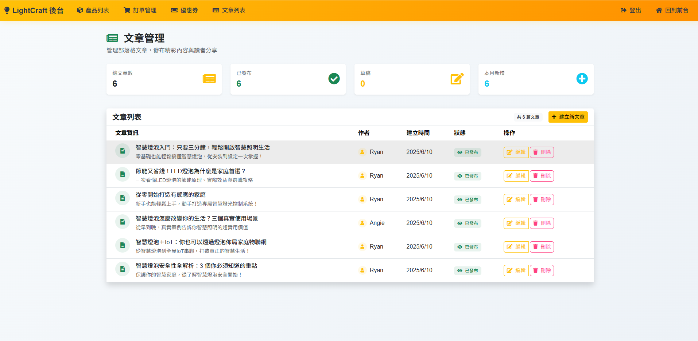

# LightCraft - 專業燈具購物網站 💡

> 點亮您的生活，從 LightCraft 開始。

一個使用 Vue 3、Vite 和 Pinia 技術棧打造的現代化燈具電商網站。從產品列表、購物車到文章專區，此專案完整模擬了一個真實世界的前端購物應用。



---

## ✨ 專案亮點 (Features)

### 🏪 前台購物功能

* **SPA 架構**：採用 Vue Router 實現快速、流暢的單頁應用體驗。
* **響應式設計**：使用 Bootstrap 5 確保在桌面、平板和手機上都有最佳瀏覽效果。
* **完整購物流程**：商品瀏覽、購物車、結帳、訂單查詢一條龍服務。
* **狀態管理**：透過 Pinia 集中管理購物車、使用者資訊等全域狀態。
* **品牌化404頁面**：創意的互動式錯誤頁面，以燈泡點亮動畫呼應品牌主題，提供友善的使用者體驗。

### 🎛️ 後台管理系統

* **現代化 UI 設計**：採用卡片式佈局、統計儀表板，提供直觀的管理體驗。
* **商品管理**：支援商品的新增、編輯、刪除，以及庫存狀態管理。
* **訂單管理**：完整的訂單處理系統，包含搜尋、篩選、狀態更新功能。
* **優惠券系統**：靈活的折扣券管理，支援有效期限和使用狀態控制。
* **內容管理**：文章發布系統，支援草稿和發布狀態切換。

### 🔧 技術特色

* **模組化元件**：將 UI 切分為可複用的元件，提高開發效率與可維護性。
* **統一設計系統**：建立完整的設計規範，確保全專案視覺一致性。
* **環境變數管理**：使用 `.env` 檔案管理 API 路徑等敏感資訊，方便部署。
* **互動式設計**：404錯誤頁面採用燈泡點亮動畫，結合品牌故事提升使用者體驗。

## 📸 專案截圖 (Screenshots)

### 🛒 前台購物體驗

| 商品列表頁 | 購物車頁面 |
| :---: | :---: |
|  |  |

| 文章專區 | 我的訂單 |
| :---: | :---: |
|  |  |

| 404錯誤頁面 |  |
| :---: | :---: |
|  |  |

### 🎛️ 後台管理系統

| 產品管理 | 訂單管理 |
| :---: | :---: |
|  |  |

| 優惠券管理 | 文章管理 |
| :---: | :---: |
|  |  |

## 🛠️ 技術棧 (Tech Stack)

* **前端框架**: Vue 3 (Options API / Composition API)
* **建置工具**: Vite
* **路由**: Vue Router 4
* **狀態管理**: Pinia
* **CSS 框架**: Bootstrap 5 & Sass
* **HTTP 客戶端**: Axios
* **程式碼規範**: ESLint (based on Airbnb)

---

## 🚀 快速開始 (Getting Started)

此章節將引導你如何將此專案安裝到你的電腦上並成功運行。

### 環境需求

* Node.js `v18.17.1` 或以上版本 (建議使用 v20+ 或 v22+)
* **必須使用 pnpm** (推薦 v8.0+ 版本)

#### 為什麼需要使用 pnpm？

此專案包含 `@rollup/rollup-win32-x64-msvc` 等平台特定的 optionalDependencies，使用 pnpm 可以避免常見的依賴安裝問題，確保在 Windows 環境下的最佳相容性。

#### 安裝 pnpm

如果尚未安裝 pnpm，請執行以下指令：

```bash
# 使用 npm 全域安裝 pnpm
npm install -g pnpm

# 或使用官方安裝腳本
curl -fsSL https://get.pnpm.io/install.sh | sh -
```

### 1. 取得專案

從 GitHub 複製此專案：

```bash
git clone https://github.com/your-repo-link.git
cd your-project-folder
```

### 2. 安裝依賴套件

**重要：請使用 pnpm 安裝套件，避免 `@rollup/rollup-win32-x64-msvc` 相關的安裝錯誤**

```bash
pnpm install
```

> ⚠️ **注意事項**：
> - 請勿使用 `npm install`，會導致 Windows 平台特定依賴安裝失敗
> - 如果先前使用過 npm，請先刪除 `node_modules` 和 `package-lock.json`

### 3. 設定環境變數

將 `.env.example` 檔案複製一份並重新命名為 `.env`。此檔案用於存放 API 路徑等環境變數。

```bash
cp .env.example .env
```

接著，請修改 `.env` 檔案中的內容：

```env
# API 伺服器路徑 (請填寫實際 API URL)
VITE_API_URL=https://your-api-server.com/api

# 您的 API Path (請填寫實際 API Path)
VITE_API_PATH=your-api-path
```

### 4. 啟動開發伺服器

執行以下指令，專案將會在 `http://localhost:5173` (預設) 上運行。

```bash
pnpm dev
```

### 其他可用指令

* **建置專案 (用於生產環境)**:

  ```bash
  pnpm build
  ```

* **檢查程式碼風格**:

  ```bash
  pnpm lint
  ```

* **自動修正程式碼風格**:

  ```bash
  pnpm lint:fix
  ```

* **格式化程式碼**:

  ```bash
  pnpm format
  ```

---

## 📁 資料夾結構

專案遵循標準的 Vue 專案結構，核心程式碼位於 `src` 資料夾。

```
/
├── docs/
│   └── images/          # 專案截圖
├── public/              # 不需編譯的靜態資源
├── src/
│   ├── assets/          # CSS, Fonts, Images
│   ├── components/      # 可複用 UI 元件
│   ├── router/          # Vue Router 路由設定
│   ├── stores/          # Pinia 狀態管理
│   ├── views/           # 頁面級元件
│   ├── App.vue          # 根元件
│   └── main.js          # 應用程式進入點
├── .eslintrc.js
├── package.json
├── README.md
└── vite.config.js
```

---
